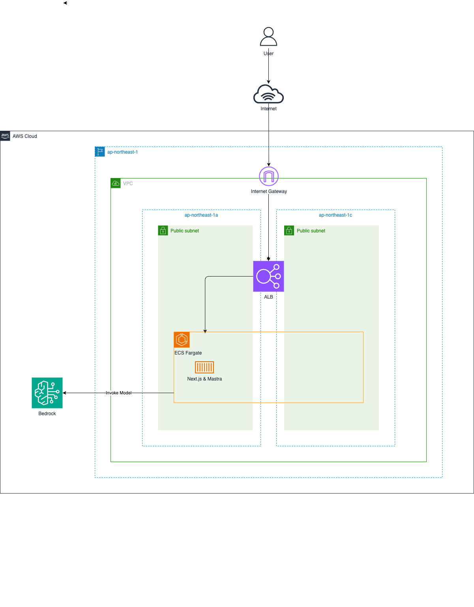

# assistant-ui-mastra-agent

本リポジトリは、技術書展本内で紹介したフルスタックTypeScriptエージェントアプリケーションのサンプルコードです。

開発手順については本書を参考にしてください。  

## 技術スタック

- **バックエンド**: Mastra (Next.jsと直接統合)
- **LLM**: Amazon Bedrock Claude Haiku 4.5
- **フロントエンド**: Next.js
- **UI**: assistant-ui
- **インフラ**: AWS ELB/ECS/ECR
- **IaC**: AWS CDK

## 構成図

